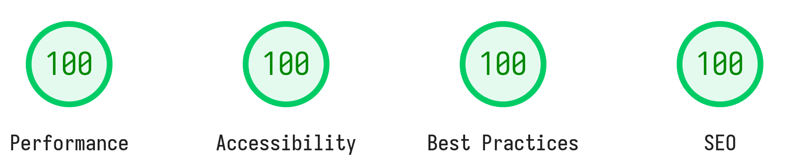

# Blog website

This blog was written for my specific needs and interests. It is not meant to be a general-purpose blog platform. Feel free to use it as a starting point for your own blog or to grab inspiration from it.

A live demo is available at [thomaspais.com](https://thomaspais.com). 

If you are interested in building a similar setup, check out my guide: [Build a static blog website with Zola from scratch](https://thomaspais.com/posts/build-a-static-blog-website-with-zola-from-scratch).

## Tech Stack

This website is built using the following technologies:

* **Static Site Generator:** [Zola](https://www.getzola.org/) (Rust-based)
* **Deployment & CI/CD:** [Netlify](https://www.netlify.com/) with custom DNS
* **Math Rendering:** [KaTeX](https://katex.org/) for high-speed client-side LaTeX processing

## Core Features

- **Dark/Light Mode** - A theme system that respects user preferences.
- **Client-SideSearch** - Fast, local indexing using `elasticlunr.js` for efficient search without relying on external services.
- **Responsive Design** - Mobile-first design ensuring compatibility from smartphones to 4K displays.
- **Performance-First** - Minimalist CSS and zero unnecessary JavaScript to ensure a sub-1s load time.
- **SEO** - Automated sitemap generation and meta tag optimization.

I achieved a perfect score across all [PageSpeed Insights](https://pagespeed.web.dev/analysis/https-thomaspais-com/upcplkwd74?form_factor=mobile) categories. This ensures a seamless experience even for users on low-bandwidth connections.

## Design

I focused on simplicity and readability, ensuring that the content is easily readable. 

You can explore the design and features of the website by visiting this [design page](https://thomaspais.com/design).
